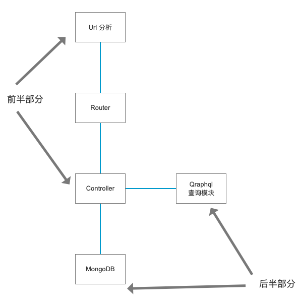

# README

## 1. 项目说明


### 1.1 目标

实现基于Graphql 查询的api服务。

- 数据层
  - 数据存在mongoDB
  - 两张表
    - book
    - author
- 接口层
  - book功能
    - 增
    - 删
    - 查，支持关联查询，书包相关作者
    - 改
  - author
    - 增
    - 删
    - 查
    - 改


## 2. Demo说明

```bash
phase1-node-express-mongodb // 参考代码： express + mongodb
phase2 // 参考代码： express + graphql
final // 整合，最后实现 express + graphql + mongodb
```

### 01-hello-world

https://tomoya92.github.io/2019/05/31/nodejs-express-graphql-tutorial/#%E5%85%B3%E8%81%94%E6%9F%A5%E8%AF%A2

#### 项目搭建

```bash

mkdir 01-hello-world && cd 01-hello-world
npm init
yarn add express express-graphql graphql

```

#### 测试

##### 启动服务

```bash
node server.js

```

##### 查询 和结果

```bash
{
  hello
}
```

点击运行，会得到结果

```bash
{
  "data": {
    "hello": "Hello world!"
  }
}
```

### 2.2 02-lodash

在hello-world基础上，改进

1. 加入测试数据
2. schema 独立模块，完整查询方式
3. schema 增加两表之间的字段关联

### 2.3 03-mongoose

1. 使用真实mongodb
2. 添加 graphql的 Mutation 操作

### 2. 03-final
### 搭建思路

EmgApi 模块搭建

#### 测试api

浏览器访问 http://localhost:4000/graphql 输入

1. 搭建EmgApi的前半部: 参考[教程](https://medium.com/codingthesmartway-com-blog/creating-a-graphql-server-with-node-js-and-express-f6dddc5320e1) 
2. 搭建后半部分： 参考[教程1](https://bezkoder.com/node-express-mongodb-crud-rest-api/)-[教程2](https://hostadvice.com/how-to/how-to-create-rest-api-with-node-express-and-mongoose/) 
## 参考

https://medium.com/codingthesmartway-com-blog/creating-a-graphql-server-with-node-js-and-express-f6dddc5320e1


https://tomoya92.github.io/2019/05/31/nodejs-express-graphql-tutorial/