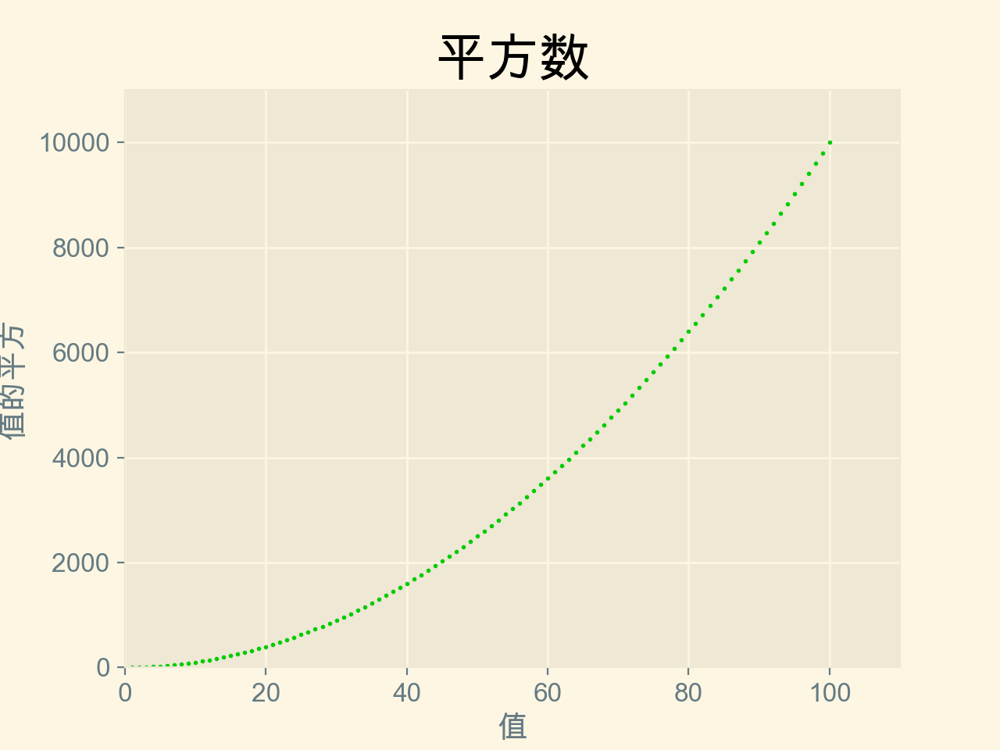

# README

## 关键词

- matplotlib
- csv/json

## matplotlib

### 官方资料

https://matplotlib.org/

### 安装

```bash
python3 -m pip install plotly
```

### plot 折线图

代码详细说明请看
'cotter_squares.py'


### scatter 散点图

代码详细说明请看
'cotter_squares.py'



对算点做了颜色映射，强化视觉效果


'/Users/tongweizj/Library/Python/3.9/bin'

### Random Walk 随机漫步

代码详细说明请看
'random_walk.py' 'rw_visual.py'

